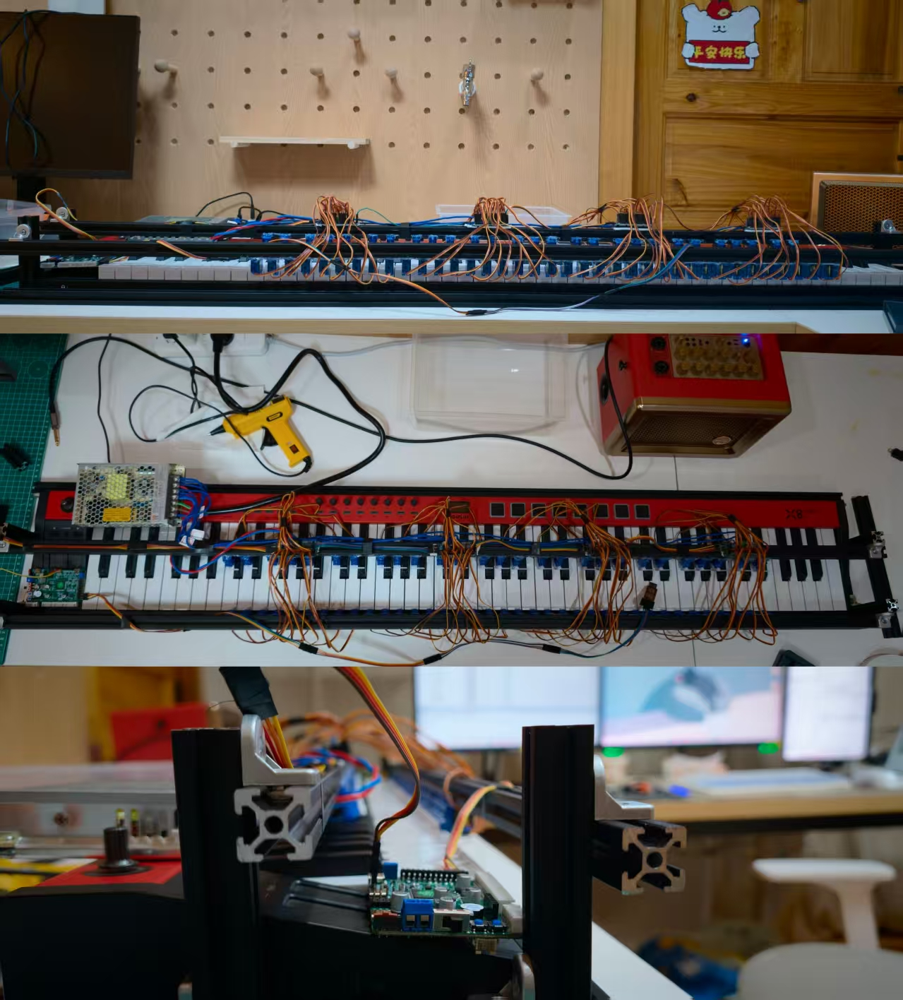
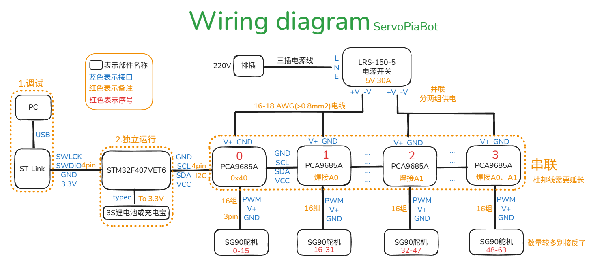

# 【ServoPiaBot】
价值：学习乐理；自动伴奏；AI音乐创作 
痛点：按键力度均匀，没有灵魂；机械震动+噪声大，弹奏不干净；程序写死，节奏反常，听感机械 
思考：是否可以通过学习的方式让机器产生情感？对声音进行一些操作，输出不均匀的舵机角度和速度（力度），是否能探索一些音乐技巧？是否能学会自主即兴？

# PLAN
### Plan1：数字舵机
不太美观；物理噪声大 
https://www.bilibili.com/video/BV1br4y1y7Ta?vd_source=e9e3ea2b38df6c311ddde1bea2d8a489
https://gfthub.com/FFtust/automatic_gita
### Plan2：推拉电磁铁
物理噪声大 
https://www.bilibili.com/video/BV16X4y1B7jB?vd_source=e9e3ea2b38df6c311ddde1bea2d8a489
### Plan3：滑轨+机械手
按不了复杂和弦；滑轨慢，节拍快弹不了 
https://www.bilibili.com/video/BV18a4y1j7Gt?vd_source=e9e3ea2b38df6c311ddde1bea2d8a489
### Plan4：机械臂+灵巧手
目前不成熟；门槛高，DIY没必要 
https://www.bilibili.com/video/BV13Jd5BwEWG?vd_source=e9e3ea2b38df6c311ddde1bea2d8a489
#### 对比了以上四种主流方案，最终决定采用方案1，理由如下： 
1.Plan3和Plan4成本1k往上，直接pass；而且为了模拟人手完全没必要，也永远不可能达到人类钢琴大师的水平 
2.论最低成本，大数量（60+）的舵机（单个SG90在5.5元左右）成本比推拉电磁铁（单个AH-520B在7.5元左右）成本便宜太多； 
3.论实现难度，Plan2推拉电磁铁方案暂未找到开源 
4.舵机和推拉电磁铁的物理噪声都无法避免，但后期可以通过物理隔离真空消音等方法减弱，加大音响音量，噪声就不那么明显 

# Material&Tool&Wiring
## hardware
STM32F407VET6（新版C30D ROS底层主控四驱） 1个 315元 
PCA9685A模块 4个 70元 
SG90舵机（9g 180°）（5组*12）60个 385元 
电源开关：MWEL的LRS-150-5（5V 30A）1个 54元 

## tool
焊台（86元）、热熔胶枪（44元） 
万用表（VC890D 89元） 
绝缘手套、绝缘电工胶带 
三芯纯铜电线（1米 15元）、粗电线（10米 直径1.5mm 10元）、接线端子排 
杜邦线（公对母、公对公、母对母 10元）、双tpec、typec转USB 
20铝型材（黑色 150元 4根1400mm，200mm 150mm 100mm若干）、20角码（20个 20元）、M4螺丝螺母垫圈镀镍（各种长度都买点 80元） 
螺丝刀、尖嘴钳、剪线钳、扳手、尺、拓展坞等 

## Programing
keil5(MDK-ARM)、STM32CubeMX、Vscode(Python)、Terminal

## Wiring
调试阶段：电脑PC端通过USB口接STLink；STLink上的SWLCK、SWDIO、GND、3.3V通过4pin杜邦线接STM32，STLink直接给STM32供电；STM32上找到GND、SCL、SDA、VCC接到PCA9685A对应端口；四个PCA9685A依次串联，第1个PCA9685A的I2C地址是0x40，控制1-16号舵机；第2个需要焊接A0，I2C地址是0x41，依次第3个焊接A1（0x42），第4个焊接A0和A1（0x43） 
1个PCA9685A模块上插16个SG90舵机，找到CA9685A模块上的PWM、V+、GND对应插入即可 
上电： 
三芯纯铜电线一端直接插排查，一端接LRS-150-5电源开关的L火、N零、E地接口；LRS-150-5电源开关输出的+V和-V分别接PCA9685A的V+和GND（给64个舵机供电） 
（独立运行：2S锂电池或充电宝给STM32供电,不同型号注意工作电压范围） 

## 机械安装
1.连线：板子、STM32、电源全部接好 
64个舵机对应5个八度组（12个/组）（舵机编号1-60依次对应大字组、小字组、小字一组、小字二组、小字三组；最后4个舵机用作测试，不固定） 
铝型材作为支撑，角码作为固定连接件；把舵机分两排固定，适应黑白键的物理落差 
用热熔胶枪直接把舵机固定在铝型材上，先不安装舵盘；全部测试舵机没问题，需要全部校准角度；最后安装舵盘，测试按压力度。 
（可以随时微调铝型材的位置以达到最好的琴键效果） 

# Problem
The Code is successfully generated under : F:/backup/portfolio/miniprogram/ServoPiaBot/ServoPiaBot Project language : C but MDK-ARM V5project generation have a problem. 
一直解决不了，都不是软件、网络、文件名的问题，项目不复杂，keil5手动创建也比较快 
一定一定要用万用表测量一下三芯纯铜电线的零火接线！！！我网上买的一根，结果商家标注的火线和零线颜色是反的！还好用表测了，不然要出大问题！万用表拨到交流750V档，一定要是L和N是220V、L和E是220V、N和E是0V才可以！ 
另外接线的时候一定不要带电操作！拔掉插头，戴绝缘手套！注意安全！ 

# Project Tree
├─ServoPiaBot                   Keil源代码 
└─Source 
    ├─Photos                        
    ├─Scripts 
    │  ├─C(.txt)                 源MIDI转化后的C文件，替换到main.c对应部分可演奏不同歌曲 
    │  ├─Code(main.c)            调试过程中的部分main.c源代码 
    │  ├─MID(.mid)               源MIDI音频文件 
    │  └─midi2c.py               MID转C脚本 
    ├─Showcase                   弹奏效果视频 
    └─Wiring                     接线及BOM 

# Shoucase
### 菊次郎的夏天：
<video src="https://github.com/user-attachments/assets/e9d6c083-28ff-4fc9-bb5c-8381d553bc86" controls="controls" width="100%"></video>

### 我的歌声里：
<video src="https://github.com/user-attachments/assets/550f6388-ff4b-4ef4-95c3-904e6b48f48c" controls="controls" width="100%"></video>

# Reference
https://github.com/FFtust/automatic_gita.git